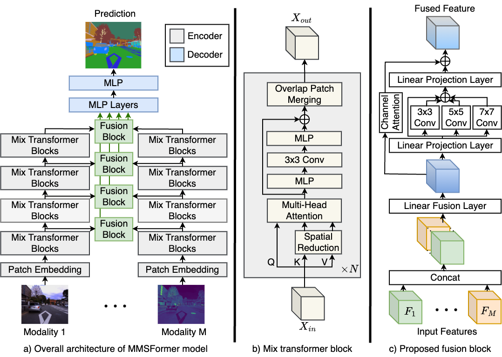

<div align="center"> 

## MMSFormer: Multimodal Transformer for Material and Semantic Segmentation

</div>

<div align="center"> 
    
[](https://paperswithcode.com/sota/semantic-segmentation-on-mcubes?p=multimodal-transformer-for-material)

[](https://paperswithcode.com/sota/semantic-segmentation-on-fmb-dataset?p=multimodal-transformer-for-material)

[](https://paperswithcode.com/sota/thermal-image-segmentation-on-pst900?p=multimodal-transformer-for-material)

<a href="https://ieeexplore.ieee.org/document/10502124/">
    
</a>
<a href="https://arxiv.org/pdf/2309.04001">
    
</a>
<a href="https://csiplab.github.io/MMSFormer/">
    
</a>
<a href="https://pytorch.org/">
    
</a>
</div>

## Introduction

Leveraging information across diverse modalities is known to enhance performance on multimodal segmentation tasks. However, effectively fusing information from different modalities remains challenging due to the unique characteristics of each modality. In this paper, we propose a novel fusion strategy that can effectively fuse information from different modality combinations. We also propose a new model named **M**ulti-**M**odal **S**egmentation Trans**Former** (**MMSFormer**) that incorporates the proposed fusion strategy to perform multimodal material and semantic segmentation tasks. MMSFormer outperforms current state-of-the-art models on three different datasets. As we begin with only one input modality, performance improves progressively as additional modalities are incorporated, showcasing the effectiveness of the fusion block in combining useful information from diverse input modalities. Ablation studies show that different modules in the fusion block are crucial for overall model performance. Furthermore, our ablation studies also highlight the capacity of different input modalities to improve performance in the identification of different types of materials.

For more details, please check our [arXiv](https://arxiv.org/abs/2309.04001) paper.

## Updates
- [x] 09/2023: Init repository.
- [x] 09/2023: Release the code for MMSFormer.
- [x] 09/2023: Release MMSFormer model weights. Download from [**GoogleDrive**](https://drive.google.com/drive/folders/1OPr7PUrL7hkBXogmHFzHuTJweHuJmlP-?usp=sharing).
- [x] 01/2024: Update code, description and pretrained weights.
- [x] 04/2024: Accepted by [IEEE Open Journal of Signal Processing](https://ieeexplore.ieee.org/document/10502124).

## MMSFormer model

<div align="center"> 


**Figure:** Overall architecture of MMSFormer model and proposed fusion block.

</div>

## Environment

First, create and activate the environment using the following commands: 
```bash
conda env create -f environment.yaml
conda activate mmsformer
```

## Data preparation
Download the dataset:
- [MCubeS](https://github.com/kyotovision-public/multimodal-material-segmentation), for multimodal material segmentation with RGB-A-D-N modalities.
- [FMB](https://github.com/JinyuanLiu-CV/SegMiF), for FMB dataset with RGB-Infrared modalities.
- [PST](https://github.com/ShreyasSkandanS/pst900_thermal_rgb), for PST900 dataset with RGB-Thermal modalities.

Then, put the dataset under `data` directory as follows:

```
data/
├── MCubeS
│   ├── polL_color
│   ├── polL_aolp_sin
│   ├── polL_aolp_cos
│   ├── polL_dolp
│   ├── NIR_warped
│   ├── NIR_warped_mask
│   ├── GT
│   ├── SSGT4MS
│   ├── list_folder
│   └── SS
├── FMB
│   ├── test
│   │   ├── color
│   │   ├── Infrared
│   │   ├── Label
│   │   └── Visible
│   ├── train
│   │   ├── color
│   │   ├── Infrared
│   │   ├── Label
│   │   └── Visible
├── PST
│   ├── test
│   │   ├── rgb
│   │   ├── thermal
│   │   └── labels
│   ├── train
│   │   ├── rgb
│   │   ├── thermal
│   │   └── labels
```

## Model Zoo

### MCubeS
| Model-Modal      | mIoU   | weight |
| :--------------- | :----- | :----- |
| MCubeS-RGB       | 50.44 | [GoogleDrive](https://drive.google.com/drive/folders/1TiC4spUgMGo8zO2iChpuuRo8cmZC2yeh?usp=sharing) |
| MCubeS-RGB-A     | 51.30 | [GoogleDrive](https://drive.google.com/drive/folders/1TiC4spUgMGo8zO2iChpuuRo8cmZC2yeh?usp=sharing) |
| MCubeS-RGB-A-D   | 52.03 | [GoogleDrive](https://drive.google.com/drive/folders/1TiC4spUgMGo8zO2iChpuuRo8cmZC2yeh?usp=sharing) |
| MCubeS-RGB-A-D-N | 53.11 | [GoogleDrive](https://drive.google.com/drive/folders/1TiC4spUgMGo8zO2iChpuuRo8cmZC2yeh?usp=sharing) |

### FMB
| Model-Modal      | mIoU   | weight |
| :--------------- | :----- | :----- |
| FMB-RGB          | 57.17 | [GoogleDrive](https://drive.google.com/drive/folders/15kuBWiEHOxxOLMxvASYzPhdSgG8ZWfgm?usp=sharing) |
| FMB-RGB-Infrared | 61.68 | [GoogleDrive](https://drive.google.com/drive/folders/15kuBWiEHOxxOLMxvASYzPhdSgG8ZWfgm?usp=sharing) |

### PST900
| Model-Modal      | mIoU   | weight |
| :--------------- | :----- | :----- |
| PST-RGB-T        | 87.45 | [GoogleDrive](https://drive.google.com/drive/folders/1yv7wfGVLrxBYQ3teDg3eL-zYJsie56Ll?usp=sharing) |


## Training

Before training, please download [pre-trained SegFormer](https://drive.google.com/drive/folders/10XgSW8f7ghRs9fJ0dE-EV8G2E_guVsT5), and put it in the correct directory following this structure:

```text
checkpoints/pretrained/segformer
├── mit_b0.pth
├── mit_b1.pth
├── mit_b2.pth
├── mit_b3.pth
└── mit_b4.pth
```

To train MMSFormer model, please update the appropriate configuration file in `configs/` with appropriate paths and hyper-parameters. Then run as follows:

```bash
cd path/to/MMSFormer
conda activate mmsformer

python -m tools.train_mm --cfg configs/mcubes_rgbadn.yaml

python -m tools.train_mm --cfg configs/fmb_rgbt.yaml

python -m tools.train_mm --cfg configs/pst_rgbt.yaml
```


## Evaluation
To evaluate MMSFormer models, please download respective model weights ([**GoogleDrive**](https://drive.google.com/drive/folders/1OPr7PUrL7hkBXogmHFzHuTJweHuJmlP-?usp=sharing)) and save them under any folder you like.

<!-- 
```text
output/
├── MCubeS
│   ├── MMSFormer_MiT_B2_MCubeS_RGB.pth
│   ├── MMSFormer_MiT_B2_MCubeS_RGBA.pth
│   ├── MMSFormer_MiT_B2_MCubeS_RGBAD.pth
│   ├── MMSFormer_MiT_B2_MCubeS_RGBNAD.pth
``` -->

Then, update the `EVAL` section of the appropriate configuration file in `configs/` and run:

```bash
cd path/to/MMSFormer
conda activate mmsformer

python -m tools.val_mm --cfg configs/mcubes_rgbadn.yaml

python -m tools.val_mm --cfg configs/fmb_rgbt.yaml

python -m tools.val_mm --cfg configs/pst_rgbt.yaml
```

## License

This repository is under the Apache-2.0 license. For commercial use, please contact with the authors.


## Citations

If you use MMSFormer model, please cite the following work:

- **MMSFormer** [[**arXiv**](https://arxiv.org/abs/2309.04001)]
```
@ARTICLE{Reza2024MMSFormer,
    author={Reza, Md Kaykobad and Prater-Bennette, Ashley and Asif, M. Salman},
    journal={IEEE Open Journal of Signal Processing}, 
    title={MMSFormer: Multimodal Transformer for Material and Semantic Segmentation}, 
    year={2024},
    volume={},
    number={},
    pages={1-12},
    keywords={Image segmentation;Feature extraction;Transformers;Task analysis;Fuses;Semantic segmentation;Decoding;multimodal image segmentation;material segmentation;semantic segmentation;multimodal fusion;transformer},
    doi={10.1109/OJSP.2024.3389812}
}
```

## Acknowledgements
Our codebase is based on the following Github repositories. Thanks to the following public repositories:
- [DELIVER](https://github.com/jamycheung/DELIVER)
- [RGBX-semantic-segmentation](https://github.com/huaaaliu/RGBX_Semantic_Segmentation)
- [Semantic-segmentation](https://github.com/sithu31296/semantic-segmentation)

**Note:** This is a research level repository and might contain issues/bugs. Please contact the authors for any query.
